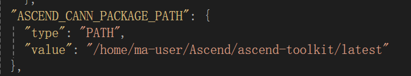
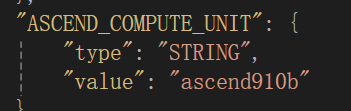
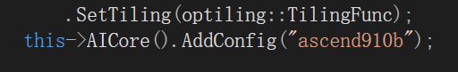

# ascendc_GPU
华为微认证ascendc中级
## 考试题目：
实现Ascend C算子Sinh,算子命名为SinhCustom，编写其kernel侧代码、host侧代码，并完成aclnn算子调用测试。
相关算法：sinh(x) = (exp(x) - exp(-x)) / 2.0

要求：

    4.1 完成Sinh算子kernel侧核函数相关代码补齐。

    4.2 完成Sinh算子host侧Tiling结构体成员变量创建，以及Tiling实现函数的补齐。

    4.3 要支持Float16类型输入输出。

    4.4 不要使用Sinh高阶API，使用高阶API不得分
### 确认算子工程目录中以下两个文件正确性：
- CmakePresets.json，确认该文件中此处配置的是正确的CANN开发包安装路径：

- 以及确认该文件中此处配置的芯片名称与开发环境相匹配

- op_host/sinh_custom.cpp，确认该文件中此处的芯片名称配置与开发环境相匹配

### 补充代码
#### sinh_custom_tiling.h
```
#include "register/tilingdata_base.h"
namespace optiling {
	BEGIN_TILING_DATA_DEF(SinhCustomTilingData)
		//考生自行定义 tiling 结构体成员变量
	TILING_DATA_FIELD_DEF(uint32_t, totalLength);
	TILING_DATA_FIELD_DEF(uint32_t, tileNum);
	END_TILING_DATA_DEF;
	REGISTER_TILING_DATA_CLASS(SinhCustom, SinhCustomTilingData)
}
```
#### sinh_custom.cpp
```
#include "sinh_custom_tiling.h"
#include "register/op_def_registry.h"
namespace optiling {
	static ge::graphStatus TilingFunc(gert::TilingContext* context)
	{
		SinhCustomTilingData tiling;
		//考生自行填充
		const uint32_t BLOCK_DIM = 8;
		const uint32_t TILE_NUM = 8;
		uint32_t totalLength = context->GetInputShape(0)->GetOriginShape().GetShapeSize();
		context->SetBlockDim(BLOCK_DIM);
		tiling.set_totalLength(totalLength);
		tiling.set_tileNum(TILE_NUM);
		tiling.SaveToBuffer(context->GetRawTilingData()->GetData(),
			context->GetRawTilingData()->GetCapacity());
		context->GetRawTilingData()->SetDataSize(tiling.GetDataSize());
		size_t* currentWorkspace = context->GetWorkspaceSizes(1);
		currentWorkspace[0] = 0;
		return ge::GRAPH_SUCCESS;
	}
}

namespace ge {
	static ge::graphStatus InferShape(gert::InferShapeContext* context)
	{
		const gert::Shape* x1_shape = context->GetInputShape(0);
		gert::Shape* y_shape = context->GetOutputShape(0);
		*y_shape = *x1_shape;
		return GRAPH_SUCCESS;
	}
}
namespace ops {
	class SinhCustom : public OpDef {
	public:
		explicit SinhCustom(const char* name) : OpDef(name)
		{
			this->Input("x")
				.ParamType(REQUIRED)
				.DataType({ ge::DT_FLOAT16 })
				.Format({ ge::FORMAT_ND })
				.UnknownShapeFormat({ ge::FORMAT_ND });
			this->Output("y")
				.ParamType(REQUIRED)
				.DataType({ ge::DT_FLOAT16 })
				.Format({ ge::FORMAT_ND })
				.UnknownShapeFormat({ ge::FORMAT_ND });
			this->SetInferShape(ge::InferShape);
			this->AICore()
				.SetTiling(optiling::TilingFunc);
			this->AICore().AddConfig("ascend910b");
		}
	};
	OP_ADD(SinhCustom);
}
```
#### sinh_custom.cpp
```
#include "kernel_operator.h"
using namespace AscendC;
constexpr int32_t BUFFER_NUM = 2;
class KernelSinh {
public:
	__aicore__ inline KernelSinh() {}
	__aicore__ inline void Init(GM_ADDR x, GM_ADDR y, uint32_t totalLength, uint32_t
		tileNum)
	{
		//考生补充初始化代码
		ASSERT(GetBlockNum() != 0 && "block dim can not be zero!");
		this->blockLength = totalLength / GetBlockNum();
		this->tileNum = tileNum;
		ASSERT(tileNum != 0 && "tile num can not be zero!");
		this->tileLength = this->blockLength / tileNum / BUFFER_NUM;
		xGm.SetGlobalBuffer((__gm__ DTYPE_X*)x + this->blockLength * GetBlockIdx(),
			this->blockLength);
		yGm.SetGlobalBuffer((__gm__ DTYPE_Y*)y + this->blockLength * GetBlockIdx(),
			this->blockLength);
		pipe.InitBuffer(inQueueX, BUFFER_NUM, this->tileLength * sizeof(DTYPE_X));
		pipe.InitBuffer(outQueueY, BUFFER_NUM, this->tileLength * sizeof(DTYPE_Y));
		pipe.InitBuffer(tmpBuffer1, this->tileLength * sizeof(DTYPE_X));
		pipe.InitBuffer(tmpBuffer2, this->tileLength * sizeof(DTYPE_X));
		pipe.InitBuffer(tmpBuffer3, this->tileLength * sizeof(DTYPE_X));
		pipe.InitBuffer(tmpBuffer4, this->tileLength * sizeof(DTYPE_X));
	}

	__aicore__ inline void Process()
	{
		//考生补充对“loopCount”的定义，注意对 Tiling 的处理
		int32_t loopCount = this->tileNum * BUFFER_NUM;
		for (int32_t i = 0; i < loopCount; i++) {
			CopyIn(i);
			Compute(i);
			CopyOut(i);
		}
	}
private:
	__aicore__ inline void CopyIn(int32_t progress)
	{
		//考生补充算子代码
		LocalTensor<DTYPE_X> xLocal = inQueueX.AllocTensor<DTYPE_X>();
		DataCopy(xLocal, xGm[progress * this->tileLength], this->tileLength);
		inQueueX.EnQue(xLocal);
	}
	__aicore__ inline void Compute(int32_t progress)
	{
		//考生补充算子计算代码
		LocalTensor<DTYPE_X> xLocal = inQueueX.DeQue<DTYPE_X>();
		LocalTensor<DTYPE_Y> yLocal = outQueueY.AllocTensor<DTYPE_Y>();
		LocalTensor<DTYPE_X> tmpTensor1 = tmpBuffer1.Get<DTYPE_X>();
		LocalTensor<DTYPE_X> tmpTensor2 = tmpBuffer2.Get<DTYPE_X>();
		LocalTensor<DTYPE_X> tmpTensor3 = tmpBuffer3.Get<DTYPE_X>();
		LocalTensor<DTYPE_X> tmpTensor4 = tmpBuffer4.Get<DTYPE_X>();
		DTYPE_X inputVal1 = -1;
		DTYPE_X inputVal2 = 0.5;
		//sinh(x) = (exp(x) - exp(-x)) / 2.0
		Muls(tmpTensor1, xLocal, inputVal1, this->tileLength);
		Exp(tmpTensor2, tmpTensor1, this->tileLength);
		Exp(tmpTensor3, xLocal, this->tileLength);
		Sub(tmpTensor4, tmpTensor3, tmpTensor2, this->tileLength);
		Muls(yLocal, tmpTensor4, inputVal2, this->tileLength);
		outQueueY.EnQue<DTYPE_Y>(yLocal);
		inQueueX.FreeTensor(xLocal);
	}

	__aicore__ inline void CopyOut(int32_t progress)
	{
		//考生补充算子代码
		LocalTensor<DTYPE_Y> yLocal = outQueueY.DeQue<DTYPE_Y>();
		DataCopy(yGm[progress * this->tileLength], yLocal, this->tileLength);
		outQueueY.FreeTensor(yLocal);
	}
private:
	TPipe pipe;
	TQue<QuePosition::VECIN, BUFFER_NUM> inQueueX;
	TQue<QuePosition::VECOUT, BUFFER_NUM> outQueueY;
	GlobalTensor<half> xGm;
	GlobalTensor<half> yGm;
	//考生补充自定义成员变量
	TBuf<QuePosition::VECCALC> tmpBuffer1, tmpBuffer2, tmpBuffer3, tmpBuffer4;
	uint32_t blockLength;
	uint32_t tileNum;
	uint32_t tileLength;
};
extern "C" __global__ __aicore__ void sinh_custom(GM_ADDR x, GM_ADDR y, GM_ADDR
	workspace, GM_ADDR tiling) {
	GET_TILING_DATA(tiling_data, tiling);
	KernelSinh op;
	//补充 init 和 process 函数调用内容
	op.Init(x, y, tiling_data.totalLength, tiling_data.tileNum);
	op.Process();
}
```
